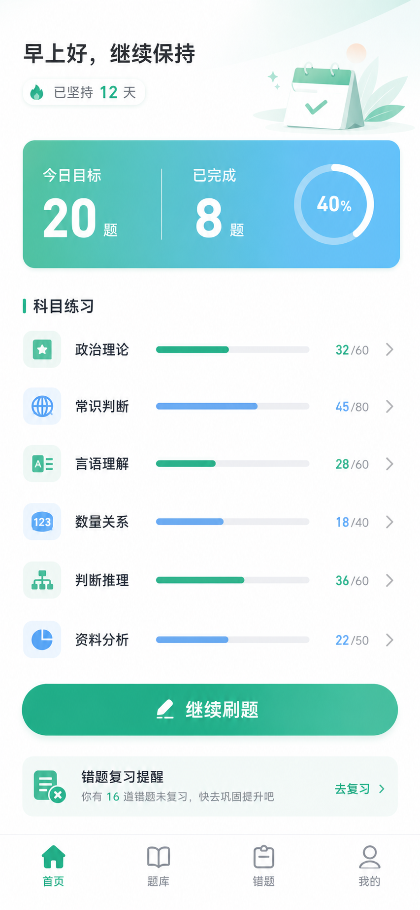
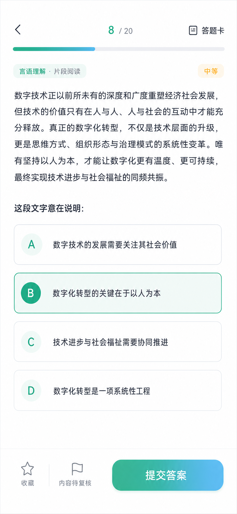
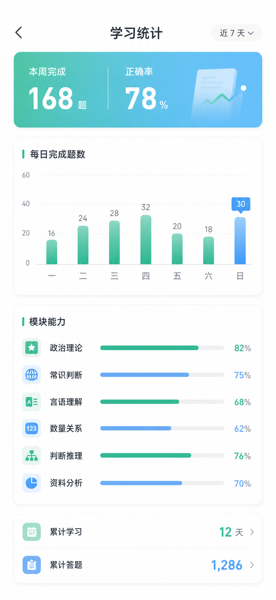

# 公考刷题微信小程序


一个无需后端即可运行的私人客观题刷题微信小程序。用户可以创建自己的科目、导入 JSON 题库，并完成练习设置、答题解析、错题巩固、收藏、历史与学习统计的完整闭环。项目不再附带内置题库。

> 本项目不是官方考试产品，不代表任何考试主管部门。题目用于学习、开发与功能演示，不能替代官方考试大纲和权威资料。

## 功能

- “我的”页可使用微信原生能力自定义昵称和头像，资料仅保存在本机
- “我的”页按当前自定义科目汇总当日做题数，以原生 Canvas 饼图和图例展示占比
- 题库页底部管理入口使用三栏等宽布局，并适配底部导航与 iPhone 安全区
- “我的”页可设置考试名称和日期，首页按自然日显示考试倒计时
- 底部“打卡”入口可按月查看打卡天数、刷题量、连续天数和每日明细，五栏布局适配底部安全区
- 自定义科目的新增、改名和安全删除
- 每个题库可在导入时或题库页设置所属科目
- 单题库练习、按科目练习和跨题库随机练习
- 题量、顺序／随机和“只练未做题”设置
- 作答、计时、解析、来源展示、前后题回看与答题卡
- 私人题库支持单选题和多选题，多选答案按集合判定且不受选择顺序影响
- 错题自动维护、按科目筛选和错题重练
- 收藏、练习历史、每日目标和连续学习天数
- 今日进度、每周趋势、总体与分科目正确率
- 微信胶囊与状态栏安全区适配
- 全部学习数据保存在本机，不依赖服务器
- 支持在小程序内校验、预览和导入私人 JSON 题库

## 界面预览

| 首页 | 答题 | 学习统计 |
| --- | --- | --- |
|  |  |  |

更多页面截图见 [`design/screens`](design/screens)。

## 技术结构

项目使用微信小程序原生技术栈，不依赖第三方运行时或后端服务。

```text
.
├── app.js / app.json / app.wxss   # 应用入口与全局样式
├── components/                    # 顶部栏、底部导航、进度条、饼图
├── pages/                         # 17 个业务页面
├── services/                      # 题库、练习会话、本地存储、统计与布局
├── questions/                     # 私人题库导入 Schema 与示例
├── tests/                         # Node.js 自动化测试
└── design/                        # 封面、界面截图与设计说明
```

关键设计：

- `question-bank.js` 统一加载、筛选和混合抽题。
- `practice-session.js` 管理选择、提交、跳题和结果汇总。
- `storage.js` 封装微信同步缓存，记录答题事件、收藏、设置和本地用户资料。
- `subject-storage.js` 管理自定义科目并迁移旧私人题库的科目归属。
- `user-bank-storage.js` 把私人题库按块保存在小程序本地文件目录。
- `user-progress.js` 从答题事件推导错题、进度、连续学习、今日科目占比、打卡月历和历史数据。

## 运行方式

1. 安装[微信开发者工具](https://developers.weixin.qq.com/miniprogram/dev/devtools/download.html)。
2. 克隆仓库并在开发者工具中选择“导入项目”。
3. 项目目录选择仓库根目录，AppID 可使用测试号，或在开发者工具生成的 `project.private.config.json` 中配置自己的 AppID。
4. 点击“编译”即可运行。

公开的 `project.config.json` 使用测试 AppID。`project.private.config.json` 已加入 `.gitignore`，请勿提交个人 AppID、密钥或上传配置。

## 导入私人题库

题库页支持从微信会话文件中选择 UTF-8 JSON，并在写入前预览有效题、格式错误、文件内重复和跨题库重复数量。导入前必须选择所属科目；没有科目时可直接创建。私人题库保存在小程序本地文件目录。

- 导入格式：[`questions/user-bank-import.schema.json`](questions/user-bank-import.schema.json)
- 可直接测试的示例：[`questions/user-bank-import.example.json`](questions/user-bank-import.example.json)
- 单个导入文件上限：10MB
- 当前支持：纯文字 A–D 单选题/多选题、解析、知识点、来源和共享材料
- JSON 可提供可选的 `subject` 作为科目名称建议，最终归属以导入页选择为准
- 单选题可省略 `type` 或使用 `single-choice`，答案是字符串；多选题使用 `multiple-choice`，答案是至少两个不重复选项组成的数组
- 删除的私人题库先进入回收站；永久删除会同时清理相关收藏和学习记录
- 题库页可把单个私人题库重新导出为标准 JSON
- 旧版本已经导入的私人题库会按原 `category` 自动创建并关联科目

使用时可先把示例或大模型生成的 JSON 发送到微信文件传输助手，再在小程序题库页点击“导入 JSON”。大模型输出必须经过小程序校验，不能把未校验内容直接作为题库使用。

## 测试

```bash
node --test tests/*.test.mjs
```

最近一次本地验证结果（2026-09-14）：

- 87 项测试全部通过
- 打卡日历的同日聚合、未来日期过滤、月首偏移、平闰年和跨年切换均通过验证
- 今日科目分布的日期过滤、同科题库合并、未知题库回退与 Canvas 接线均通过验证
- 题库页底部预留、安全区与三栏工具布局通过静态验证
- 考试设置校验/清除、未设置、未来、今天、过期、跨月和跨年倒计时均通过验证
- 私人题库示例、Schema、科目迁移、题库归属、单选和多选链路均通过验证
- 六套旧内置题库及其生成模块已删除

## 数据、版权与隐私

- 项目不内置题目；使用者应确保拥有所导入题库的合法使用权，并自行核验题目、答案和来源。
- 项目不包含登录、广告、支付、网络上报或远程分析代码；学习记录与用户资料均仅保存在微信本地。
- 提交代码前请确认 `project.private.config.json`、真实 AppID、密钥、用户数据和调试日志未进入版本控制。

完整说明见 [内容与隐私说明](CONTENT_NOTICE.md)。

## 许可证

程序代码采用 [MIT License](LICENSE)。题库及引用资料的使用边界以 [内容与隐私说明](CONTENT_NOTICE.md) 为准。

